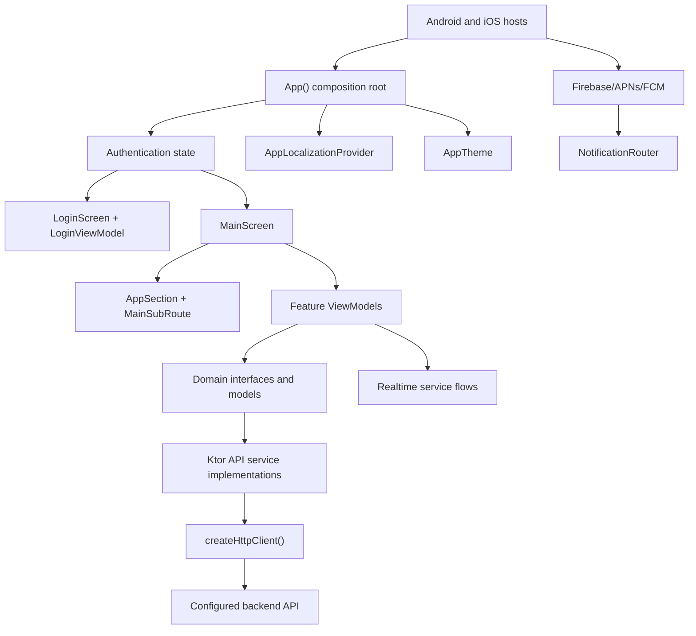

# Application architecture

The application is organized as a shared Kotlin Multiplatform frontend with platform hosts.

## Layers

## Composition root

`App()` in `shared/src/commonMain/kotlin/org/example/project/App.kt` is the top-level shared UI. It:

- creates a Ktor `HttpClient` through `createHttpClient()`;
- creates `AuthApiService`;
- initializes push notifications and token refresh handling;
- loads the saved `UserSession`;
- validates saved sessions with the backend;
- selects login or main application UI;
- saves updated session information after login and profile changes;
- unregisters the device token and clears session storage on logout.

## Main screen dependency assembly

`MainScreen()` in `presentation/menu/MainScreen.kt` creates feature API services and ViewModels after a user is authenticated. The authenticated token is passed into API service constructors. This keeps unauthenticated UI limited to login and session validation.

Important dependencies assembled in `MainScreen()`:

- task, project, user, stock, orders, returns, audit log, chat, and time-entry API services;
- `TaskListViewModel`, `ProjectListViewModel`, `AdminViewModel`, `StockViewModel`, `OrdersViewModel`, `ReturnsViewModel`, `AuditLogsViewModel`, `ChatViewModel`, and `ActiveTimerViewModel`;
- Reverb/Pusher-compatible realtime services for chat and task time entries;
- `AuthApiService` for profile phone number updates in `UserDetailDialog`.

## HTTP client

`createHttpClient()` installs:

- Kotlinx serialization with `ignoreUnknownKeys = true`;
- Ktor logging at `INFO`;
- Ktor WebSockets.

Android uses the OkHttp engine. iOS uses the Darwin engine.

## Error handling pattern

API services generally:

- send `Accept: application/json`;
- send `Authorization: Bearer <token>` for authenticated endpoints;
- parse response bodies manually with Kotlinx serialization;
- convert non-success statuses into `Result.failure` or thrown exceptions depending on the interface;
- fall back to generic user-facing messages when backend error parsing fails.

ViewModels convert API failures into state fields such as `error`, `errorMessage`, `dialogErrorMessage`, or form-specific validation messages.

