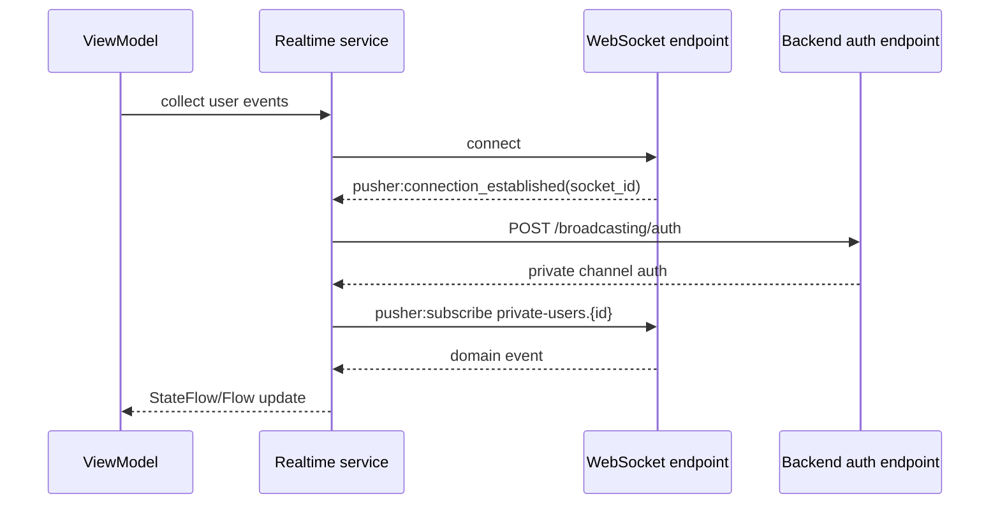

# Real-time functionality, notifications, analytics, and third-party integrations

## Reverb/Pusher-compatible realtime flows

The app has two realtime services:

- `ReverbChatRealtimeService` emits `ChatNotificationEvent` values.
- `ReverbTaskTimeEntryRealtimeService` emits `TimeEntryRealtimeEvent.Started` and `TimeEntryRealtimeEvent.Stopped`.

Both services:

1. derive a WebSocket URL from generated Reverb settings and API base URL;
2. connect with Ktor WebSockets;
3. wait for `pusher:connection_established`;
4. authenticate the private user channel through `/broadcasting/auth`;
5. subscribe to `private-users.{userId}`;
6. respond to `pusher:ping` with `pusher:pong`;
7. reconnect after a delay when non-cancellation failures occur.

## Chat refresh strategy

`ChatViewModel` loads conversations and users, listens for realtime chat notifications, persists read state, and starts a polling fallback. It also supports optimistic message IDs for outgoing messages before the backend response is applied.

## Active timer synchronization

`ActiveTimerViewModel` loads the current active timer and listens on the user's private channel. Remote start/stop events update the current timer state so multiple devices stay aligned.

## Push notifications

Android uses Firebase Messaging through `LumiFirebaseMessagingService`. iOS uses APNs registration and Firebase Messaging through `AppDelegate` and the Kotlin bridge in `IosPushBridge.kt`.

The shared `PushNotificationCoordinator`:

- is configured with the app HTTP client and generated base URL;
- registers the FCM token after login;
- registers refreshed tokens when a user is authenticated;
- unregisters the last known token on logout when possible.

`NotificationRouter` supports these deep-link types:

| Type | Required data | Result |
| --- | --- | --- |
| `task_assigned` | `task_id` | Opens task detail. |
| `task_unassigned` | `task_id` | Opens task detail. |
| `task_status_changed` | `task_id` | Opens task detail. |
| `chat_message_received` | `conversation_id`, optional `message_id` | Opens chat conversation. |
| `workspace_call_incoming` | `call_id`, optional `call_action`, `caller_name`, `call_type`, `call_mode`, `conversation_id` | Opens or answers incoming call UI. |
| `workspace_call_updated` | `call_id`, optional `call_action` | Refreshes active call state or dismisses ringing. |

## Workspace call push payload (Android)

Incoming call FCM messages should be **high-priority data-only** payloads so `LumiFirebaseMessagingService.onMessageReceived` runs while the app is backgrounded or killed.

Minimum data keys:

| Key | Example | Notes |
| --- | --- | --- |
| `type` | `workspace_call_incoming` | Also `workspace_call_updated` for terminal/answered states. |
| `call_id` | `uuid` | Used for accept/decline and LiveKit reconnect. |
| `caller_name` | `Jane Doe` | Shown in ringing notification and full-screen UI. |
| `caller_user_id` | `12` | Telecom caller identity. |
| `call_type` | `audio` or `video` | Controls camera and notification labels. |
| `call_mode` | `1v1` or `group` | Group calls keep ringing until all decline or timeout. |
| `status` | `ringing` | Optional; updated events use terminal statuses. |
| `call_action` | `answer`, `decline` | Set when user taps notification actions. |

Optional `title` and `body` are used as notification fallback text. Avoid a top-level FCM `notification` payload for calls.

On `workspace_call_incoming`, Android starts `IncomingCallRingingService` (looping ringtone + vibration) and may show `IncomingCallActivity` via full-screen intent. `call_action` and `call_id` are forwarded through `NotificationRouter` to `CallViewModel.openFromNotification`.

Device tokens for Android are registered with `platform: fcm_android` and a stable `device_id` from `ClientInstanceIdStorage`.

## Realtime call events

`ReverbCallRealtimeService` listens on `private-users.{userId}` for:

- `call.incoming`
- `call.ringing`
- `call.accepted`
- `call.declined`
- `call.cancelled`
- `call.ended`
- `call.updated`

Group in-call roster updates use `presence-call.{callId}` with `participant.joined` and `participant.left` via `ReverbCallPresenceRealtimeService`.

## Analytics

No analytics SDK or analytics event pipeline is present in the inspected repository.

## Third-party integrations

- Firebase Cloud Messaging for Android and iOS push notifications.
- Reverb/Pusher-compatible realtime protocol for private user channels.
- Ktor for HTTP and WebSocket networking.
- Coil for image loading in Compose UI.

