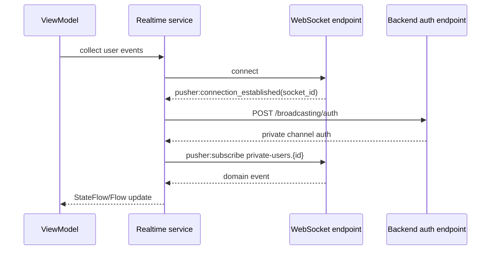

# Real-time functionality, notifications, analytics, and third-party integrations

## Reverb/Pusher-compatible realtime flows

The app has two realtime services:

- `ReverbChatRealtimeService` emits `ChatNotificationEvent` values.
- `ReverbTaskTimeEntryRealtimeService` emits `TimeEntryRealtimeEvent.Started` and `TimeEntryRealtimeEvent.Stopped`.

Both services:

1. derive a WebSocket URL from generated Reverb settings and API base URL;
2. connect with Ktor WebSockets;
3. wait for `pusher:connection_established`;
4. authenticate the private user channel through `/broadcasting/auth`;
5. subscribe to `private-users.{userId}`;
6. respond to `pusher:ping` with `pusher:pong`;
7. reconnect after a delay when non-cancellation failures occur.

## Chat refresh strategy

`ChatViewModel` loads conversations and users, listens for realtime chat notifications, persists read state, and starts a polling fallback. It also supports optimistic message IDs for outgoing messages before the backend response is applied.

## Active timer synchronization

`ActiveTimerViewModel` loads the current active timer and listens on the user's private channel. Remote start/stop events update the current timer state so multiple devices stay aligned.

## Push notifications

Android uses Firebase Messaging through `LumiFirebaseMessagingService`. iOS uses APNs registration and Firebase Messaging through `AppDelegate` and the Kotlin bridge in `IosPushBridge.kt`.

The shared `PushNotificationCoordinator`:

- is configured with the app HTTP client and generated base URL;
- registers the FCM token after login;
- registers refreshed tokens when a user is authenticated;
- unregisters the last known token on logout when possible.

`NotificationRouter` supports these deep-link types:

| Type | Required data | Result |
| --- | --- | --- |
| `task_assigned` | `task_id` | Opens task detail. |
| `task_unassigned` | `task_id` | Opens task detail. |
| `task_status_changed` | `task_id` | Opens task detail. |
| `chat_message_received` | `conversation_id`, optional `message_id` | Opens chat conversation. |

## Analytics

No analytics SDK or analytics event pipeline is present in the inspected repository.

## Third-party integrations

- Firebase Cloud Messaging for Android and iOS push notifications.
- Reverb/Pusher-compatible realtime protocol for private user channels.
- Ktor for HTTP and WebSocket networking.
- Coil for image loading in Compose UI.

