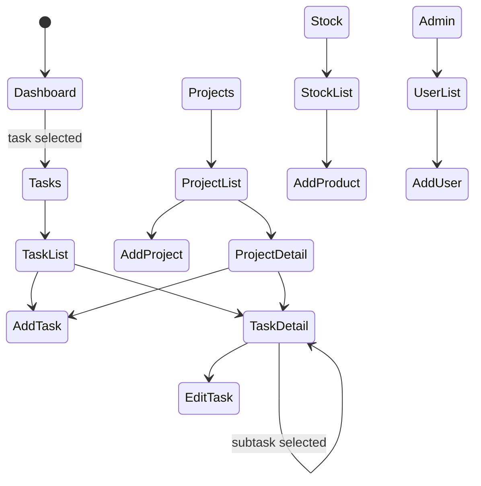

# Routing, layouts, pages, and navigation

The application does not use a URL router. Navigation is modeled with Compose state:

- `AppAuthState` selects loading, logged-out, or logged-in UI.
- `AppSection` selects the main top-level section.
- `MainSubRoute` represents nested detail and create/edit screens.
- `subRouteStack` in `MainScreen()` is an in-memory stack for nested navigation.
- `PlatformBackHandler` pops dialogs, chat detail state, or subroutes.

## Top-level sections

| Section | Screen | Visibility |
| --- | --- | --- |
| Dashboard | `DashboardScreen` | All authenticated users |
| Tasks | `TaskListScreen`, task detail, add/edit task | All authenticated users |
| Projects | `ProjectListScreen`, project detail, add project, task detail | All authenticated users |
| Chat | `ChatScreen` | All authenticated users |
| Stock | `StockScreen`, `AddProductScreen` | All authenticated users |
| Orders | `OrdersScreen` | All authenticated users |
| Returns | `ReturnsScreen` | All authenticated users |
| Admin | `AdminScreen`, `AddUserScreen` | `UserRole.ADMIN` only |
| Audit Logs | `AuditLogsScreen` | `UserRole.ADMIN` only |

`AppDrawer` receives all available sections. `AppBottomBar` receives only sections with `showInBottomBar = true`.

## Nested route stack

## Notification deep links

`NotificationRouter` parses push payloads into `NotificationDeepLink` values. `MainScreen()` consumes the pending link and routes:

- task assignment, unassignment, or status change events to `AppSection.TASKS` and then task detail;
- chat message events to `AppSection.CHAT` and then the selected conversation.

After handling, `NotificationRouter.consume()` clears the pending link.

## Documentation coverage check

`scripts/check_route_docs.py` reads `AppSection.kt` and `MainSubRoute.kt`, then verifies that all declared sections and subroutes appear in this page. Run it after adding or renaming app sections or subroutes.

