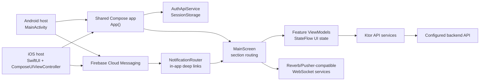

# Lumi Mobile maintainer documentation

Lumi Mobile is a Kotlin Multiplatform mobile frontend for workspace operations, sales administration, and internal communication. The shared Compose Multiplatform code implements the application UI, navigation, authenticated API access, persisted session handling, real-time updates, Firebase push notification routing, and feature-level state management. Android and iOS host projects provide platform entry points, notification registration, Firebase integration, and platform-specific persistence.

This documentation is intended for maintainers. It describes what is present in the repository and how the application is assembled without exposing local secrets, credentials, private configuration values, or sensitive operational procedures.

## Primary code areas

| Area | Purpose |
| --- | --- |
| `shared/src/commonMain/kotlin/org/example/project` | Shared app, domain models, API services, ViewModels, Compose screens, localization, theme, notification routing. |
| `shared/src/androidMain/kotlin/org/example/project` | Android HTTP engine, session/read-state storage, push notification implementation, platform back handling. |
| `shared/src/iosMain/kotlin/org/example/project` | iOS HTTP engine, session/read-state storage, push notification bridge, Compose view controller. |
| `androidApp` | Android application shell, manifest, Firebase messaging service registration, Gradle Android application configuration. |
| `iosApp` | SwiftUI host app, Firebase setup, APNs/FCM delegate, Xcode project files. |
| `gradle` | Version catalog and Gradle wrapper configuration. |
| `docs`, `mkdocs.yml`, `requirements-docs.txt` | Maintainer documentation site and pinned documentation dependencies. |
| `scripts` | Documentation quality checks for route coverage, links, and sensitive content. |

## Runtime overview

## Maintainer entry points

- Start with [Local setup](setup.md) to install tools and understand configuration keys.
- Use [Application architecture](architecture/overview.md) to understand dependencies and request flow.
- Use [Routing and navigation](architecture/routing.md) before changing screens or section visibility.
- Use [API and data contracts](architecture/api.md) before changing backend integration.
- Use [Testing, builds, and deployment](maintenance/testing-builds-deployment.md) before opening or merging changes.
- Use [Technical debt and operational risks](maintenance/technical-debt-risks.md) when planning hardening work.

