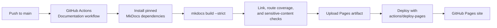

# Testing, linting, type checking, builds, deployment, and operations

## Application validation commands

Run these commands before merging application changes:

```bash
./gradlew :shared:allTests
./gradlew :androidApp:lintDebug
./gradlew :shared:compileAndroidMain
./gradlew :androidApp:assembleDebug
./gradlew :androidApp:assembleRelease
```

Depending on the local Xcode setup, iOS validation may require opening the Xcode project or invoking the relevant Xcode build scheme outside Gradle.

## Documentation validation commands

```bash
python3 -m venv .venv-docs
source .venv-docs/bin/activate
pip install -r requirements-docs.txt
mkdocs build --strict
python3 scripts/check_docs_links.py
python3 scripts/check_route_docs.py
python3 scripts/scan_docs_for_secrets.py
```

## GitHub Pages deployment

The repository contains a GitHub Actions workflow at `.github/workflows/docs.yml`. It:

1. installs pinned Python documentation dependencies;
2. builds MkDocs in strict mode;
3. checks internal documentation links;
4. checks route/page documentation coverage;
5. scans documentation for high-risk sensitive content patterns;
6. uploads the static site artifact;
7. deploys through GitHub Pages.

The expected public URL is:

```text
https://Aiconomy-AG.github.io/lumi-mobile/
```



GitHub Pages must be configured to use GitHub Actions as the build and deployment source. If the authenticated account cannot configure Pages, a repository administrator must enable Pages for Actions-based deployment.

## Operational procedures

- Do not commit local `local.properties` values.
- Do not publish environment URLs, credentials, tokens, service-account data, keystore passwords, or Firebase configuration contents in docs.
- Treat mobile push configuration files and signing assets as sensitive operational material even when they are already present in the repository.
- Prefer backend-enforced authorization for all restricted data and operations.
- Use documentation scripts when adding sections, routes, or docs links.

## Troubleshooting

| Symptom | Likely area to inspect |
| --- | --- |
| App stays logged out after restart | Session storage initialization, `AuthApiService.validateSession()`, backend auth status. |
| API calls fail after login | Generated `ApiConfig`, token propagation, backend response shape, Ktor logs. |
| Realtime does not connect | Reverb config keys, app key presence, WebSocket scheme/host/port, `/broadcasting/auth`. |
| Push notifications arrive but do not route | Payload `type` and ID keys, `NotificationRouter.parse()`, platform intent/userInfo bridge. |
| Admin pages missing | `UserSession.role`, `AppSection.adminOnly`, backend role mapping. |
| MkDocs build fails | Broken nav entry, broken internal link, Mermaid syntax, missing dependency from `requirements-docs.txt`. |
