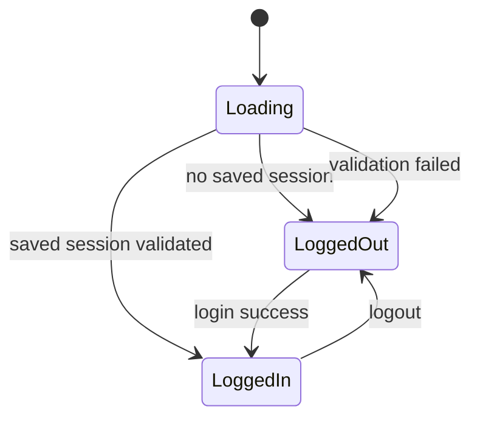
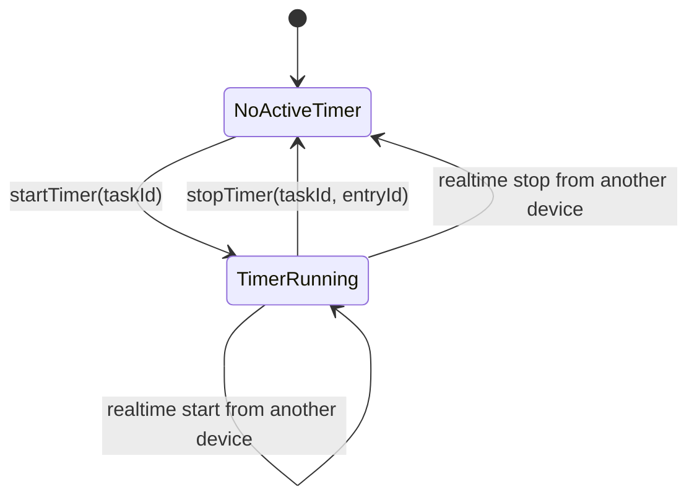
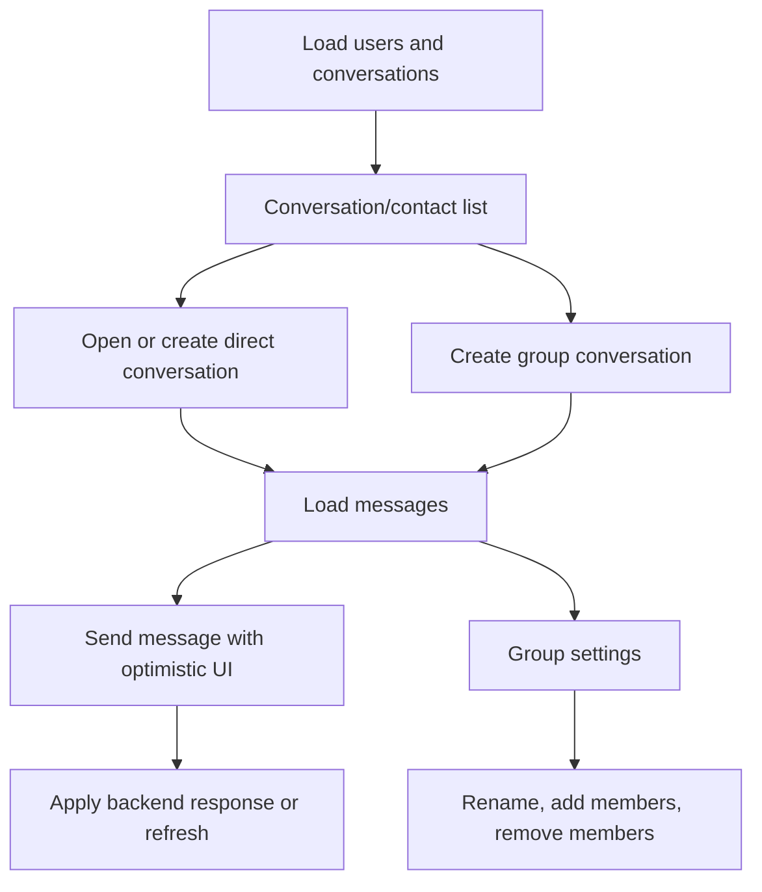

# Important state transitions and user workflows

## Authentication workflow

## Task workflow

Tasks can be listed, searched, filtered by status, filtered to the current user, created, edited, assigned, unassigned, deleted, and opened from notifications or the dashboard. Root tasks can have subtasks; subtasks cannot create further subtasks according to `Task.canCreateSubtask()`.

Time tracking is attached to tasks:

## Project workflow

Projects are listed and searched. A project can be created, opened, and used as context for task creation. Project detail shows tasks associated with that project and can route into task detail.

## Stock workflow

Products are loaded with variants and categories. Maintainers can add products, edit product fields, delete products, add variants, edit variants, and delete variants. Product deletion also removes variants according to the UI warning.

## Chat workflow

Realtime events refresh affected conversations and messages. Read state is persisted per user.

## Notification workflow

1. Platform push service receives a notification.
2. Platform code extracts string-like payload fields.
3. `NotificationRouter.parse()` maps known payloads to a `NotificationDeepLink`.
4. `MainScreen()` observes and consumes the pending link.
5. The app navigates to the relevant task or conversation.

